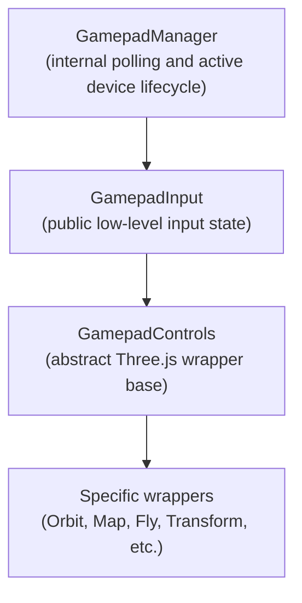

# Three.js Gamepad Controls

Gamepad support for [Three.js](https://threejs.org) controls, built on top of [Web Gamepad API](https://developer.mozilla.org/en-US/docs/Web/API/Gamepad_API).

## Architecture



## 📦 Installation

npm:

```bash
npm i three-gamepad-controls
```

pnpm:

```bash
pnpm add three-gamepad-controls
```

Yarn:

```bash
yarn add three-gamepad-controls
```

Deno:

```bash
deno add npm:three-gamepad-controls
```

Bun:

```bash
bun add three-gamepad-controls
```

## 📖 Documentation

- [Core](./docs/core.md) — The fundamental building blocks.
- [GamepadInput](./docs/gamepad-input.md) - Low-level reader for gamepad buttons, axes, sticks, and transitions.
- [GamepadControls](./docs/gamepad-controls.md) — Abstract base class for custom gamepad controls.
- [GamepadArcballControls](./docs/gamepad-arcball-controls.md) - Gamepad support for `ArcballControls`.
- [GamepadDragControls](./docs/gamepad-drag-controls.md) - Gamepad support for `DragControls`.
- [GamepadFirstPersonControls](./docs/gamepad-first-person-controls.md) — Gamepad support for `FirstPersonControls`.
- [GamepadFlyControls](./docs/gamepad-fly-controls.md) — Gamepad support for `FlyControls`.
- [GamepadMapControls](./docs/gamepad-map-controls.md) — Gamepad support for `MapControls`.
- [GamepadOrbitControls](./docs/gamepad-orbit-controls.md) — Gamepad support for `OrbitControls`.
- [GamepadPointerLockControls](./docs/gamepad-pointer-lock-controls.md) — Gamepad support for `PointerLockControls`.
- [GamepadTrackballControls](./docs/gamepad-trackball-controls.md) — Gamepad support for `TrackballControls`.
- [GamepadTransformControls](./docs/gamepad-transform-controls.md) — Gamepad support for `TransformControls`.
