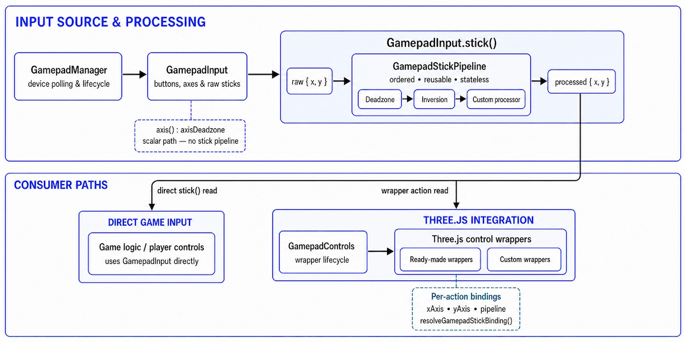

# Three.js Gamepad Controls

Gamepad support for [Three.js](https://threejs.org) controls, built on top of [Web Gamepad API](https://developer.mozilla.org/en-US/docs/Web/API/Gamepad_API).

> [!WARNING]
> This library has not reached version 1.0.0 and should not yet be considered stable. Until 1.0.0, minor releases may include breaking changes.

## 🏗️ Architecture



The library is organized around `GamepadInput`, which owns the internal gamepad manager for selection and polling, exposes buttons, axes, sticks, haptics, and standard mappings, and processes stick reads through ordered, reusable, stateless pipelines. Applications can consume it directly for gameplay, menus, and custom interactions, or use `GamepadControls` and its ready-made or custom wrappers to integrate with Three.js. Each wrapper action resolves its own axes and pipeline.

## 📦 Installation

npm:

```bash
npm i three three-gamepad-controls
npm i -D @types/three # optional: for TypeScript projects
```

pnpm:

```bash
pnpm add three three-gamepad-controls
pnpm add -D @types/three # optional: for TypeScript projects
```

Yarn:

```bash
yarn add three three-gamepad-controls
yarn add -D @types/three # optional: for TypeScript projects
```

Deno:

When using `deno.json`, Deno stores dependencies in `imports` and does not separate `devDependencies`; `-D` only applies when writing to `package.json`.

```bash
# deno.json
deno add three @types/three three-gamepad-controls
```

```bash
# package.json
deno add --package-json three three-gamepad-controls
deno add --package-json -D @types/three # optional: for TypeScript projects
```

Bun:

```bash
bun add three three-gamepad-controls
bun add -d @types/three # optional: for TypeScript projects
```

## 📖 Documentation

- [Core](./docs/core.md) — The fundamental building blocks.
- [GamepadInput](./docs/gamepad-input.md) - Low-level reader for gamepad buttons, axes, sticks, and transitions.
- [Gamepad Stick Processing](./docs/gamepad-stick-processing.md) - Stateless processors, pipelines, and action bindings.
- [Haptic Feedback](./docs/haptic-feedback.md) - Optional gamepad vibration effects with graceful degradation.
- [Multiple Gamepads](./docs/multiple-gamepads.md) - Assign different gamepads to controls, players, and gameplay inputs.
- [GamepadControls](./docs/gamepad-controls.md) — Abstract base class for custom gamepad controls.
- [GamepadArcballControls](./docs/gamepad-arcball-controls.md) - Gamepad support for `ArcballControls`.
- [GamepadDragControls](./docs/gamepad-drag-controls.md) - Gamepad support for `DragControls`.
- [GamepadFirstPersonControls](./docs/gamepad-first-person-controls.md) — Gamepad support for `FirstPersonControls`.
- [GamepadFlyControls](./docs/gamepad-fly-controls.md) — Gamepad support for `FlyControls`.
- [GamepadMapControls](./docs/gamepad-map-controls.md) — Gamepad support for `MapControls`.
- [GamepadOrbitControls](./docs/gamepad-orbit-controls.md) — Gamepad support for `OrbitControls`.
- [GamepadPointerLockControls](./docs/gamepad-pointer-lock-controls.md) — Gamepad support for `PointerLockControls`.
- [GamepadTrackballControls](./docs/gamepad-trackball-controls.md) — Gamepad support for `TrackballControls`.
- [GamepadTransformControls](./docs/gamepad-transform-controls.md) — Gamepad support for `TransformControls`.
