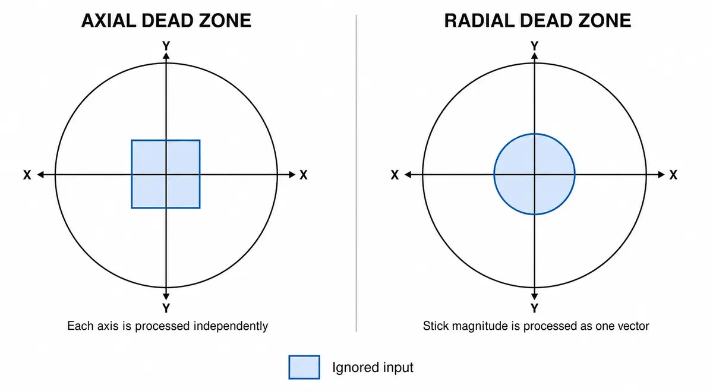

# GamepadInput

Gamepad input state reader for gameplay, menus, and custom interactions.

`GamepadInput` uses the same [Web Gamepad API](https://developer.mozilla.org/en-US/docs/Web/API/Gamepad_API) lifecycle as the [Three.js](https://threejs.org) control wrappers, but it does not wrap a Three.js control. Use it when you want direct button, axis, or stick state in your own application code.

`GamepadInput` owns its internal gamepad manager. Applications create and update only `GamepadInput`; `GamepadManager` is not part of the public API.

## Constructor

`new GamepadInput(options?)`

| Option | Type | Default | Description |
| --- | --- | --- | --- |
| `deadzone` | `number` | `0.1` | Default axis dead zone threshold. |
| `gamepadIndex` | `number` | `undefined` | Browser-assigned gamepad slot to select. When omitted, selects the connected gamepad with the lowest index. |

`gamepadIndex` must be an integer from [`MIN_GAMEPAD_INDEX`](./core.md#min_gamepad_index) through [`MAX_GAMEPAD_INDEX`](./core.md#max_gamepad_index); any other value throws a `RangeError`. An explicit index never falls back to another gamepad. See [Multiple Gamepads](./multiple-gamepads.md) for slot reuse, lifecycle, and multi-player examples.

## Properties

| Property | Type | Description |
| --- | --- | --- |
| `enabled` | `boolean` | When `false`, input polling is paused. |
| `gamepad` | `Gamepad \| null` | The active gamepad snapshot, or `null`. |
| `connected` | `boolean` | Whether a gamepad is currently active. |
| `mapping` | `GamepadMappingType \| null` | Mapping reported by the active gamepad. |
| `rawGamepad` | `Gamepad \| null` | Alias for the active raw gamepad snapshot. |
| `vibrationSupported` | `boolean` | Whether the active gamepad exposes the current vibration API. |

## Methods

### `update()`

Polls the gamepad and refreshes current and previous button state. Call this once per frame before reading buttons, axes, or sticks.

### `dispose()`

Removes window-level gamepad event listeners and clears stored state.

### `isPressed(button)`

Returns whether a button is currently pressed.

### `wasPressed(button)`

Returns `true` only on the update where a button changes from released to pressed.

### `wasReleased(button)`

Returns `true` only on the update where a button changes from pressed to released. Disconnecting a gamepad clears state without producing artificial release transitions.

### `buttonValue(button)`

Returns the current analog value for a button. Digital pressed buttons fall back to `1`, and unavailable buttons return `0`.

### `axis(axis, options)`

Returns an axis value after dead zone processing. Pass `options.deadzone` to override the instance default for one read.

### `stick(xAxis, yAxis, options)`

Returns `{ x, y }` after dead zone processing. The default `options.deadzoneMode` is `"axial"`, which processes each axis independently and preserves the existing `axis()` behavior. Pass `"radial"` to compare the stick's distance from the center with the dead zone.



```ts
const look = gamepadInput.stick(GAMEPAD_AXIS.RightX, GAMEPAD_AXIS.RightY, {
  deadzone: 0.15,
  deadzoneMode: "radial",
});
```

Both modes return the original values outside the dead zone; they do not rescale the output.

### `playVibrationEffect(type, parameters?)`

Plays an effect through the active gamepad's primary vibration actuator. It returns a `Promise<GamepadHapticsResult | null>` and resolves to `null` when vibration is unavailable or temporarily cannot be played.

### `resetVibration()`

Stops the active vibration effect. It returns a `Promise<GamepadHapticsResult | null>` and resolves to `null` when no supported actuator is available.

See [Haptic Feedback](./haptic-feedback.md) for effect parameters, graceful degradation behavior, and examples.

## Events

| Event | Extra fields | Description |
| --- | --- | --- |
| `connected` | `gamepad: Gamepad` | Fired when a gamepad is adopted as active. |
| `disconnected` | `gamepad: Gamepad` | Fired when the active gamepad disconnects or is replaced in the same slot. |

## Usage

### Character movement

Use `GamepadInput` directly when input drives gameplay rather than a Three.js controls wrapper. The following example moves a character across the XZ plane, supports a held sprint button, and starts a jump on a button transition:

```ts
import { Timer, Vector3 } from "three";
import {
  GAMEPAD_AXIS,
  GAMEPAD_BUTTON,
  GamepadInput,
} from "three-gamepad-controls";

const gamepadInput = new GamepadInput({ deadzone: 0.15 });
const timer = new Timer();
const movement = new Vector3();

renderer.setAnimationLoop((timestamp) => {
  timer.update(timestamp);
  const delta = timer.getDelta();

  // Poll before reading buttons or axes.
  gamepadInput.update();

  const stick = gamepadInput.stick(
    GAMEPAD_AXIS.LeftX,
    GAMEPAD_AXIS.LeftY,
  );

  // Stick up is negative Y, which maps naturally to forward (-Z).
  movement.set(stick.x, 0, stick.y);

  // Prevent diagonal movement from being faster.
  if (movement.lengthSq() > 1) {
    movement.normalize();
  }

  const speed = gamepadInput.isPressed(GAMEPAD_BUTTON.RightShoulder)
    ? 8
    : 4;

  player.position.addScaledVector(movement, speed * delta);

  if (gamepadInput.wasPressed(GAMEPAD_BUTTON.South)) {
    startJump();
  }

  renderer.render(scene, camera);
});

// Clean up when the input is no longer needed.
renderer.setAnimationLoop(null);
gamepadInput.dispose();
timer.dispose();
```

Call `update()` once per frame before reading input. Use `stick()` for continuous movement, `isPressed()` for held actions such as sprinting, and `wasPressed()` for one-shot transitions such as starting a jump. Vertical movement, collision handling, and jump physics remain application responsibilities; `startJump()` represents that integration point.
