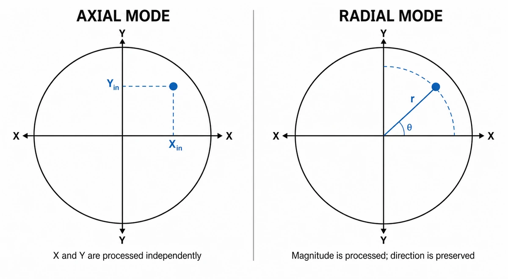
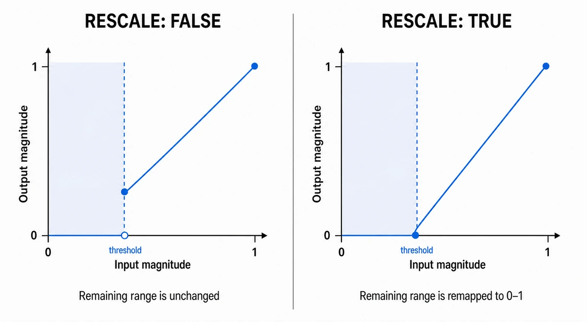
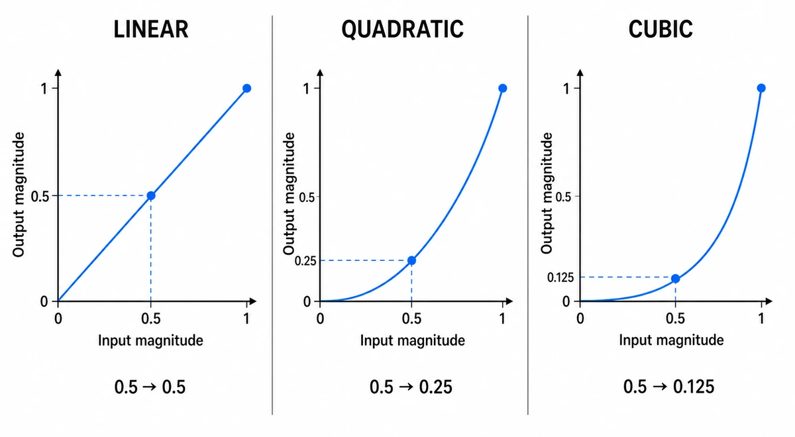
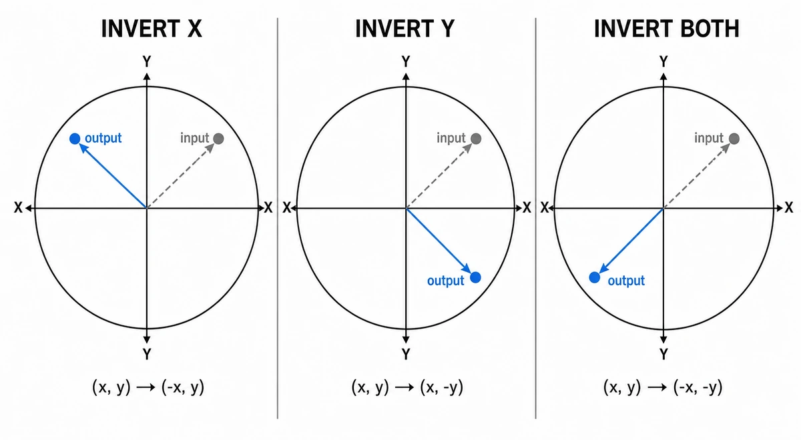

# Gamepad Stick Processing

The library processes two-dimensional stick input with an ordered, stateless pipeline. A pipeline keeps transformations such as deadzones, response curves, and inversion independent from `GamepadInput` and lets each input action use its own processing policy.

```text
raw { x, y }
  -> stage 1
  -> stage 2
  -> ...
  -> processed { x, y }
```

Stages run exactly in the configured order. The pipeline does not reorder them, catch exceptions, clamp values, or normalize custom results.

## Creating a pipeline

Use `gamepadStickPipeline(options?)` and append processing stages with fluent methods:

```ts
import { gamepadStickPipeline } from "three-gamepad-controls";

const lookPipeline = gamepadStickPipeline({ mode: "radial" })
  .deadzone(0.12, { rescale: true })
  .responseCurve("cubic")
  .invert("y");
```

The pipeline itself implements `GamepadStickProcessor`, so it can be processed directly or passed anywhere a stick pipeline is accepted:

```ts
const look = lookPipeline.process({ x: 0.5, y: -0.25 });
```

Every fluent method returns a new frozen pipeline. Existing pipelines remain unchanged and can be reused as intermediate configurations:

```ts
const normalizedStick = gamepadStickPipeline({ mode: "radial" }).deadzone(
  0.12,
  { rescale: true },
);

const movementPipeline = normalizedStick.responseCurve("quadratic");
const lookPipeline = normalizedStick.responseCurve("cubic").invert("y");
```

An empty pipeline is an identity operation:

```ts
const rawPipeline = gamepadStickPipeline();
```

`DEFAULT_GAMEPAD_STICK_PIPELINE` is equivalent to `gamepadStickPipeline().deadzone()`. It preserves the historical axial deadzone of `0.1` without rescaling, a response curve, or inversion.

## Processing modes

`GamepadStickProcessingMode` is the shared `"axial" | "radial"` geometry used by processing stages that operate on either stick components or vector magnitude:

- `"axial"` transforms X and Y independently and can change vector direction.
- `"radial"` transforms magnitude once and preserves vector direction.

The `mode` passed to `gamepadStickPipeline()` becomes the default for every compatible stage. It defaults to `"axial"`. A stage-specific `mode` has higher precedence:

```ts
const mixedPipeline = gamepadStickPipeline({ mode: "radial" })
  .deadzone(0.12)
  .responseCurve("quadratic", { mode: "axial" });
```

The deadzone above is radial, while the response curve is axial. Inversion and custom processors do not use the pipeline mode.

The mode only determines how a compatible stage interprets the stick value. It does not create a dead zone or discard input by itself.



## Fluent methods

### `deadzone(threshold?, options?)`

| Parameter | Type | Default | Description |
| --- | --- | --- | --- |
| `threshold` | `number` | `0.1` | Neutral-region threshold. |
| `options.mode` | `"axial" \| "radial"` | Pipeline mode | Processes components independently or processes vector magnitude. |
| `options.rescale` | `boolean` | `false` | Remaps the remaining component range or magnitude to start at zero. |

Axial mode applies the threshold independently to X and Y. Radial mode compares `Math.hypot(x, y)` with the threshold and, when rescaling, preserves direction while remapping magnitude.

The diagram uses non-negative magnitude, so the same response applies to an axial component or to radial vector magnitude, depending on the configured mode.



### `responseCurve(curve, options?)`

| Parameter | Type | Default | Description |
| --- | --- | --- | --- |
| `curve` | `"linear" \| "quadratic" \| "cubic"` | Required | Transforms normalized component or magnitude values. |
| `options.mode` | `"axial" \| "radial"` | Pipeline mode | Processes components independently or processes vector magnitude. |

The built-in response curves map magnitudes in the normalized `[0, 1]` range:

| Response curve | Formula | Output at `0.5` |
| --- | --- | --- |
| `"linear"` | `m` | `0.5` |
| `"quadratic"` | `m²` | `0.25` |
| `"cubic"` | `m³` | `0.125` |

Axial mode preserves each component's sign while applying the response curve to its magnitude independently. Radial mode applies the response curve to `Math.hypot(x, y)` and scales both components by the same amount, preserving direction. Component or vector magnitudes above `1` remain unchanged.



### `invert(axis)`

`GamepadStickInversionAxis` is the `"x" | "y" | "both"` selection accepted by `invert()`. The selected components are negated. Inversion preserves canonical zero and does not produce `-0` for neutral components.



```ts
const invertedLook = gamepadStickPipeline().invert("y");
```

### `transform(operation)`

`GamepadStickTransform` is the callback type accepted by `transform()`. Use it for a one-off pure transformation. The callback receives the current readonly stick value and must return a complete `{ x, y }` result:

```ts
const swappedAxes = gamepadStickPipeline().transform(({ x, y }) => ({
  x: y,
  y: x,
}));
```

The callback result is passed directly to the next stage. Out-of-range values and thrown errors remain the caller's responsibility.

### `pipe(processor)`

Use `pipe()` to append a reusable `GamepadStickProcessor`. Another pipeline is also a processor and can therefore be composed directly:

```ts
const normalizedStick = gamepadStickPipeline({ mode: "radial" })
  .deadzone(0.12, { rescale: true })
  .responseCurve("cubic");

const lookPipeline = gamepadStickPipeline()
  .pipe(normalizedStick)
  .transform(({ x, y }) => ({ x: y, y: x }))
  .invert("y");
```

`GamepadStickProcessor` is the low-level extension contract:

```ts
type GamepadStickProcessor = {
  process(value: Readonly<GamepadStick>): GamepadStick;
};
```

Implementations must be pure and stateless: do not mutate `value`, retain frame-to-frame state, or return partial results.

## Using a pipeline with GamepadInput

Set an instance default with `stickPipeline`:

```ts
const input = new GamepadInput({
  stickPipeline: lookPipeline,
});

const look = input.stick(GAMEPAD_AXIS.RightX, GAMEPAD_AXIS.RightY);
```

Pass a third argument to replace the instance default for one read:

```ts
const movement = input.stick(
  GAMEPAD_AXIS.LeftX,
  GAMEPAD_AXIS.LeftY,
  movementPipeline,
);
```

The per-read pipeline replaces the instance pipeline completely; it is not merged or appended. `axis()` remains a scalar API and uses `axisDeadzone`, not a stick pipeline.

## Action bindings

`GamepadStickBindingOptions` groups the axes and pipeline for a two-dimensional input action. Its `xAxis`, `yAxis`, and `pipeline` fields are optional so callers can override only the parts they need. `GamepadStickBinding` represents the corresponding fully resolved configuration.

```ts
import {
  DEFAULT_GAMEPAD_STICK_PIPELINE,
  GAMEPAD_AXIS,
  type GamepadStickBinding,
  type GamepadStickBindingOptions,
  resolveGamepadStickBinding,
} from "three-gamepad-controls";

const DEFAULT_LOOK_STICK: GamepadStickBinding = {
  xAxis: GAMEPAD_AXIS.RightX,
  yAxis: GAMEPAD_AXIS.RightY,
  pipeline: DEFAULT_GAMEPAD_STICK_PIPELINE,
};

type GameInputOptions = {
  lookStick?: GamepadStickBindingOptions;
};

const options: GameInputOptions = {
  lookStick: {
    pipeline: lookPipeline,
  },
};

const lookStick = resolveGamepadStickBinding(
  DEFAULT_LOOK_STICK,
  options.lookStick,
);

const look = input.stick(lookStick.xAxis, lookStick.yAxis, lookStick.pipeline);
```

`resolveGamepadStickBinding(defaults, options?)` resolves each field independently with nullish fallback. An omitted or `undefined` field preserves its default, while a supplied pipeline replaces the complete default pipeline. The result always contains `xAxis`, `yAxis`, and `pipeline`.

## Stateful processing

This pipeline intentionally excludes smoothing, hysteresis, rate limiting, acceleration, and any processor whose result depends on previous frames or elapsed time. Those effects require lifecycle, reset, and timing semantics that a reusable stateless pipeline cannot provide safely. They need a separate stateful abstraction rather than a processor that silently retains state.
